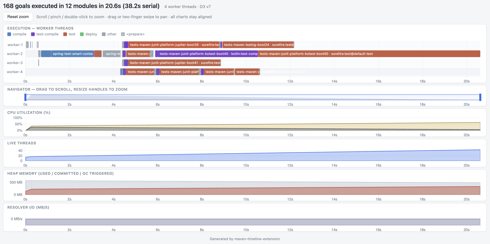

[](https://central.sonatype.com/artifact/com.github.seregamorph/maven-turbo-builder/overview)
[](LICENSE)

# Maven Timeline extension
This extension generated built task timeline which shows how maven worker threads are actually loaded while building
the project. Also it shows aligned CPU, heap, threds and resolver IO charts. The timeline can be zoomed to see smaller
details. Beyond the maven goal execution the timeline has the "preparation" phase of any module which is mostly
resolving the dependencies.

The sample report [preview](docs/build-report.html):


The report is generated at `target/timeline/build-report.html` under the root project directory, it's a single HTML file
with all needed resources. The chart UI is built using the [D3.js](https://d3js.org/).

To set up the extension add to `.mvn/extensions.xml` in the root of the project
```xml
<extensions>
    <extension>
        <!-- https://github.com/maven-turbo-reactor/maven-timeline-extension -->
        <groupId>com.github.seregamorph</groupId>
        <artifactId>maven-timeline-extension</artifactId>
        <version>0.1</version>
    </extension>
</extensions>
```
