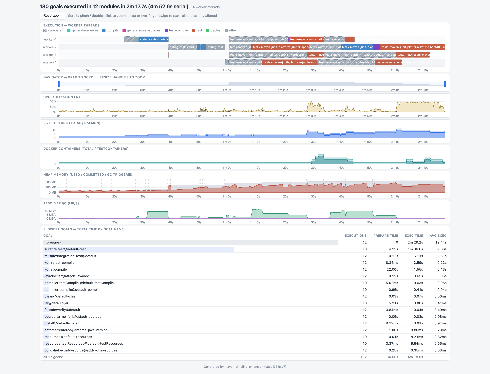

[](https://central.sonatype.com/artifact/com.github.seregamorph/maven-turbo-builder/overview)
[](LICENSE)

# Maven Timeline extension
This extension generates Maven build task timeline report which shows how the worker threads are actually loaded while
building the project. Also, it shows aligned CPU, heap, threads and the artifact resolver IO charts.
The timeline can be zoomed to see smaller details. Before the maven goal execution the timeline has the "preparation" 
phase of any module which is mostly resolving the dependencies. A goal that failed the build is highlighted in red on 
the timeline (and pinned on the navigator), so a failed build report shows at a glance where and when it broke.
If `docker` CLI is available, the report also shows the number of running docker containers (total and the ones created
by [Testcontainers](https://testcontainers.com/)); the chart is hidden if no container was running during the build.
Disable docker tracking with `-DtimelineDocker=false`.

The sample interactive report [preview](https://maven-turbo-reactor.github.io/maven-timeline-extension/build-report.html):


The report is generated at `target/timeline/build-report.html` under the root project directory, it's a single HTML file
with the build data inlined. The chart UI is built using the [D3.js](https://d3js.org/), which is loaded from a CDN, so
viewing the report requires network access.

To set up the extension add to `.mvn/extensions.xml` in the root of the project
```xml
<extensions>
    <extension>
        <!-- https://github.com/maven-turbo-reactor/maven-timeline-extension -->
        <groupId>com.github.seregamorph</groupId>
        <artifactId>maven-timeline-extension</artifactId>
        <version>0.6</version>
    </extension>
</extensions>
```
